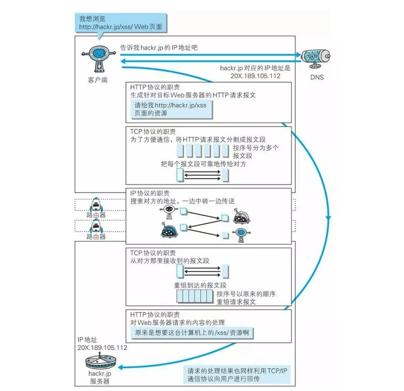

## `http` 长连接、短连接

- 在 `HTTP/1.0` 中默认使用短连接。也就是说，客户端和服务器每进行一次 `HTTP` 操作，就建立一次连接，任务结束就中断连接。
  当客户端浏览器访问的某个 `HTML` 或其他类型的 `Web` 页中包含有其他的Web资源（如JavaScript文件、图像文件、CSS文件等），
  每遇到这样一个Web资源，浏览器就会重新建立一个HTTP会话。
- 而从 `HTTP/1.1` 起，默认使用长连接，用以保持连接特性。使用长连接的HTTP协议，会在响应头加入这行代码：`Connection:keep-alive`
- 在使用长连接的情况下，当一个网页打开完成后，客户端和服务器之间用于传输HTTP数据的TCP连接不会关闭，客户端再次访问这个服务器时，会继续使用这一条已经建立的连接。
  Keep-Alive不会永久保持连接，它有一个保持时间，可以在不同的服务器软件（如Apache）中设定这个时间。实现长连接需要客户端和服务端都支持长连接。
- HTTP协议的长连接和短连接，实质上是TCP协议的长连接和短连接。

## 如何理解 `HTTP` 协议是无状态的

> HTTP协议是无状态的，指的是协议对于事务处理没有记忆能力，服务器不知道客户端是什么状态。
> 也就是说，打开一个服务器上的网页和上一次打开这个服务器上的网页之间没有任何联系。
> HTTP是一个无状态的面向连接的协议，无状态不代表HTTP不能保持TCP连接，更不能代表HTTP使用的是UDP协议（无连接）

## 各种协议与 `HTTP` 协议之间的关系

## `Socket` 连接与 `HTTP` 连接的联系与区别

- 通常情况下 `Socket` 连接就是 `TCP` 连接，因此 `Socket` 连接一旦建立，通信双方即可开始
  相互发送数据内容，直到双方连接断开。但在实际网络应用中，客户端到服务器之间的通信往往需
  要穿越多个中间节点，例如路由器、网关、防火墙等，大部分防火墙默认会关闭长时间处于非活跃
  状态的连接而导致Socket连接断连，因此需要通过轮询告诉网络，该连接处于活跃状态。
- 而HTTP连接使用的是“请求—响应”的方式，不仅在请求时需要先建立连接，而且需要客户端向服务器发出请求后，服务器端才能回复数据。
- 很多情况下，需要服务器端主动向客户端推送数据，保持客户端与服务器数据的实时与同步。
  此时若双方建立的是 `Socket连接`，服务器就可以直接将数据传送给客户端；若双方建立的是
  HTTP连接，则服务器需要等到客户端发送一次请求后才能将数据传回给客户端，因此，客户端定时
  向服务器端发送连接请求，不仅可以保持在线，同时也是在“询问”服务器是否有新的数据，如果有就将数据传给客户端。

## `HTTP` 的缓存机制

`HTTP` 的缓存主要利用 `header` 里的两个字段来控制：

- `Cache-control` 主要包含以及几个字段：
    - `private`：则只有客户端可以缓存
    - `public`：客户端和代理服务器都可以缓存
    - `max-age`：缓存的过期时间
    - `no-cache`：需要使用对比缓存来验证缓存数据
    - `no-store`：所有内存都不会进行缓存
- `ETag`：即用来进行对比缓存，`Etag` 是服务端资源的一个标识码
    - 当客户端发送第一次请求时服务端会下发当前请求资源的标识码 `Etag`，下次再请求时，
        客户端则会通过 `header` 里的 `If-None-Match` 将这个标识码 `Etag` 带上，服务端将
        客户端传来的 `Etag` 与最新的资源 `Etag`做对比，如果一样，则表示资源没有更新，返回304。
通过 `Cache-control` 和 `Etag` 的配合来实现HTTP的缓存机制。

## `Cookie`

`Cookie` 就是用来在本地缓存记住一些状态的，一个 `Cookie` 一般都包含 `domain` (所属域)、`path`、`Expires` (过期时间)等几个属性。服务端可以通过在响应头 `set-cookies` 将状态写入
客户端的 `Cookie` 中。

## `HTTP 2.0` 与 `HTTP 1.x` 相比有什么优点

- 二进制格式：`HTTP 1.x` 是文本协议，而 `HTTP 2.0` 是二进制以帧为基本单位，是一个二进制
  协议，一帧中除了包含数据外同时还包含该帧的标识：`Stream Identifier`，即标识了该帧属于
  哪个 `request`，使得网络传输变得十分灵活。
- 多路复用: 一个很大的改进，原先 `HTTP 1.x` 一个连接一个请求的情况有比较大的局限性，
  也引发了很多问题，如建立多个连接的消耗以及效率问题。
    - `HTTP 1.x` 为了解决效率问题，可能会尽量多的发起并发的请求去加载资源，然而浏览器对
      于同一域名下的并发请求有限制，而优化的手段一般是将请求的资源放到不同的域名下来突破这种限制。
    - 而 `HTTP 2.0` 支持的多路复用可以很好的解决这个问题，多个请求共用一个TCP连接，
      多个请求可以同时在这个TCP连接上并发，一个是解决了建立多个TCP连接的消耗问题，一个也
      解决了效率的问题。那么是什么原理支撑多个请求可以在一个TCP连接上并发呢？基本原理就
      是上面的二进制分帧，因为每一帧都有一个身份标识，所以多个请求的不同帧可以并发的无序
      发送出去，在服务端会根据每一帧的身份标识，将其整理到对应的request中。
- `header` 头部压缩：主要是通过压缩 `header` 来减少请求的大小，减少流量消耗，提高效率。
  因为之前存在一个问题是，每次请求都要带上 `header`，而这个 `header` 中的数据通常是一成
  不变的。
- 支持服务端推送

## 流量控制

> 流量控制是对一条通信路径上的流量进行控制，就是发送方通过获取接收方的回馈来动态调整发送
> 的速率，来达到控制流量的效果，其目的是保证发送者的发送速度不超过接收者的接收速度。

## 拥塞控制

> 拥塞控制是对整个通信子网的流量进行控制，属于全局控制。

- 慢开始+拥塞避免
- 快重传+快恢复

    - 快重传：重传机制都是等到超时还未收到接收方的回复，才开始进行重传。而快重传的设计思路是：如果发送方收到3个重复的接收方的ACK，就可以判断有报文段丢失，此时就可以立即重传丢失的报文段，而不用等到设置的超时时间到了才开始重传，提高了重传的效率。
    - 快恢复：拥塞控制会在网络拥塞时将拥塞窗口降为1，重新慢开始，这样存在的一个问题就是网络无法很快恢复到正常状态。快恢复就是来优化这个问题的，使用快恢复，则出现拥塞时，拥塞窗口只会降低到新的慢开始门阀值（即12），而不会降为1，然后直接开始进入拥塞避免加法增长。 