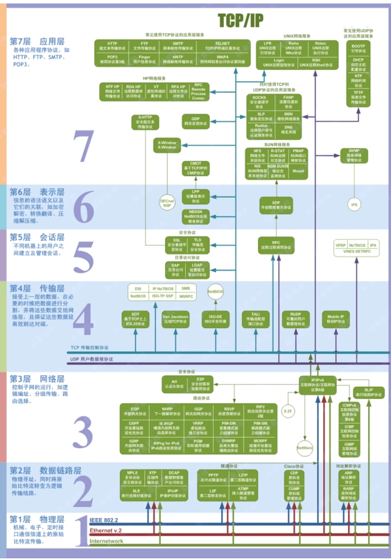

## `TCP` 三次握手和四次挥手

- 建立 `TCP` 连接需要三次握手： 首先 `Client` 端发送连接请求报文，
  `Server` 端接收连接后回复 `ACK` 报文，并为这次连接分配资源。`Client` 端接收到 `ACK` 报
  文后也向 `Server` 端发发送 `ACK` 报文，并分配资源，这样 `TCP` 连接就建立了。

    - 第一步：客户端的 `TCP` 先向服务器的 `TCP` 发送一个连接请求报文。
        这个特殊的报文中不含应用层数据，其首部中的 `SYN` 标志位被置1。另外， 客户端会随
        机选择一个起始序号 `seq=x`(连接请求报文不携带数据，但要消耗掉一个序号)。
    - 第二步：服务器端的 `TCP` 收到连接请求报文后，若同意建立连接，就向客户端发送请求，
        并为该 `TCP` 连接分配 `TCP` 缓存和变量。在确认报文中，`SYN` 和 `ACK` 位都被置为
        `1`, 确认好字段的值为 `x+1`，并且服务器随机产生起始序号 `seq=y` (确认报文不携带
        数据, 但也要消耗掉一个序号)。确认报文同样不包含应用层数据。
    - 第三步：当客户端收到确认报文后，还要向服务器给出确认，并且也要给该连接分配缓存和变
        量。这个报文的 `ACK` 标志位被置为 `1`，序号字段为 `x+1`，确认号字段为 `y+1`。

- 四次挥手

    - 第一步：客户端打算关闭连接，就向其 `TCP` 发送一个连接释放报文，并停止再发送数据，
        主动关闭 `TCP` 连接，该报文的 `FIN` 标志位被置 `1`，`seq=u`，它等于前面已经传送
        过的数据的最后一个字节的序号加 `1`( `FIN` 报文即使不携带数据，也要消耗掉一个序
        号)。
    - 第二步：服务器接收连接释放报文后即发出确认，确认号是 `ack=u+1`，这个报文自己的序号
        是 `v` ，等于它前面已传送过的数据的最后一个自己的序号加 `1`。此时，从客户端到服
        务器这个方向的连接就释放了，`TCP` 连接处于半关闭状态。但服务器若发送数据，客户端
        仍要接收，即从服务器到客户机的连接仍未关闭。
    - 第三步：若服务器已经没有了要向客户端发送的数据，就通知 `TCP` 释放连接，此时其发出
        `FIN=1` 的连接释放报文。
    - 第四步: 客户端收到连接释放报文后，必须发出确认。在确认报文中，`ACK` 字段被置为 
        `1`，确认号 `ack=w+1`，序号 `seq=u+1`。此时，`TCP`连接还没有释放掉，必须经过等待
        计时器设置的时间 `2MSL` 后, `A` 才进入到连接关闭状态。

## 计算机网络体系

### 1. 应用层

> 应用层( `application-layer` ）的任务是通过应用进程间的交互来完成特定网络应用。
> 应用层协议定义的是应用进程（进程：主机中正在运行的程序）间的通信和交互的规则。
> 对于不同的网络应用需要不同的应用层协议。在互联网中应用层协议很多，如 `域名系统 DNS` ，
> 支持万维网应用的 `HTTP` 协议，支持电子邮件的 `SMTP` 协议等等。我们把应用层交互的数据单元称为报文。

#### 1.1 域名系统

- 域名系统( `Domain Name System` 缩写 `DNS`，`Domain Name`被译为域名)是因特网
    的一项核心服务，它作为可以将域名和IP地址相互映射的一个分布式数据库，能够使人
    更方便的访问互联网，而不用去记住能够被机器直接读取的IP数串。

#### 1.2 `http` 协议

- 超文本传输协议（ `HTTP，HyperText Transfer Protocol`)是互联网上应用最为广泛的一种网络
  协议。所有的 `WWW`（万维网） 文件都必须遵守这个标准。

### 2. 运输层

> 运输层( `transport layer` )的主要任务就是负责向两台主机进程之间的通信提供通用的数据传
> 输服务。应用进程利用该服务传送应用层报文。“通用的”是指并不针对某一个特定的网络应用，
> 而是多种应用可以使用同一个运输层服务。由于一台主机可同时运行多个线程，
> 因此运输层有复用和分用的功能。所谓复用就是指多个应用层进程可同时使用下面运输层的服务
> ，分用和复用相反，是运输层把收到的信息分别交付上面应用层中的相应进程。

#### 2.1 运输层常用的两种协议 `TCP`  `UDP`

  * 传输控制协议 `TCP`（ `Transmisson Control Protocol` ）--提供面向连接的，可靠的数据传输服务
  * 用户数据协议 `UDP`（ `User Datagram Protocol` ）--提供无连接的，尽最大努力的数据传输服务（不保证数据传输的可靠性）

#### 2.2 `TCP` 的主要特点
* `TCP` 是面向连接的。（就好像打电话一样，通话前需要先拨号建立连接，通话结束后要挂机释放连接）
* 每一条 `TCP` 连接只能有两个端点，每一条 `TCP` 连接只能是点对点的（一对一）；
* `TCP` 提供可靠交付的服务。通过 `TCP` 连接传送的数据，无差错、不丢失、不重复、并且按序到达；
* `TCP` 提供全双工通信。`TCP` 允许通信双方的应用进程在任何时候都能发送数据。TCP连接
    的两端都设有发送缓存和接收缓存，用来临时存放双方通信的数据；
* 面向字节流。`TCP` 中的`“流”`（`Stream`）指的是流入进程或从进程流出的字节序列。
    `“面向字节流”`的含义是：虽然应用程序和 `TCP` 的交互是一次一个数据块（大小不等）
    ，但 `TCP` 把应用程序接下来的数据仅仅看成是一连串的无结构的字节流。

#### 2.3 `UDP` 的主要特点
* `UDP` 是无连接的；
* `UDP` 使用尽最大努力交付，即不保证可靠交付，因此主机不需要维持复杂的链接状态（这里面有许多参数）；
* `UDP` 是面向报文的；
* `UDP` 没有拥塞控制，因此网络出现拥塞不会使源主机的发送速率降低（对实时应用很有用，如直播，实时视频会议等）；
* `UDP` 支持一对一、一对多、多对一和多对多的交互通信；
* `UDP` 的首部开销小，只有8个字节，比 `TCP` 的20个字节的首部要短。

### 3. 网络层

* 在计算机网络中进行通信的两个计算机之间可能会经过很多个数据链路，也可能还要经过很多通信
  子网。网络层的任务就是选择合适的网间路由和交换结点， 确保数据及时传送。在发送数据时，
  网络层把运输层产生的报文段或用户数据报封装成分组和包进行传送。在 `TCP/IP` 体系结构中，
  由于网络层使用 `IP` 协议，因此分组也叫 `IP数据报` ，简称数据报。
* 互联网是由大量的异构（`heterogeneous`）网络通过路由器（`router`）相互连接起来的。
  互联网使用的网络层协议是 `无连接的网际协议`（`Intert Prococol`）和许多路由选择协议，
  因此互联网的网络层也叫做 `网际层或IP层`。

### 4. 数据链路层

* 数据链路层(`data link layer`)通常简称为链路层。两台主机之间的数据传输，总是在一段一段
  的链路上传送的，这就需要使用专门的链路层的协议。 在两个相邻节点之间传送数据时，
  数据链路层将网络层接下来的IP数据报组装成帧，在两个相邻节点间的链路上传送帧。
  每一帧包括数据和必要的控制信息（如同步信息，地址信息，差错控制等）
* 在接收数据时，控制信息使接收端能够知道一个帧从哪个比特开始和到哪个比特结束。
  这样，数据链路层在收到一个帧后，就可从中提取数据部分，上交给网络层。
  控制信息还使接收端能够检测到所收到的帧中有无差错。
  如果发现差错，数据链路层就简单地丢弃这个出了差错的帧，以避免继续在网络中传送下去，
  浪费网络资源。如果需要改正数据在链路层传输时出现差错（这就是说，
  数据链路层不仅要检错，而且还要纠错），那么就要采用可靠性传输协议来纠正出现的差错。
  这种方法会使链路层的协议复杂些。

### 5. 物理层

* 在物理层上所传送的数据单位是比特。 物理层(`physical layer`)的作用是实现相邻计算机节点
  之间比特流的透明传送，尽可能屏蔽掉具体传输介质和物理设备的差异。使其上面的数据链路层不
  必考虑网络的具体传输介质是什么。“透明传送比特流”表示经实际电路传送后的比特流没有发生变
  化，对传送的比特流来说，这个电路好像是看不见的。
* 在互联网使用的各种协中最重要和最著名的就是 `TCP/IP` 两个协议。

## 计算机网络的七层体系结构图

