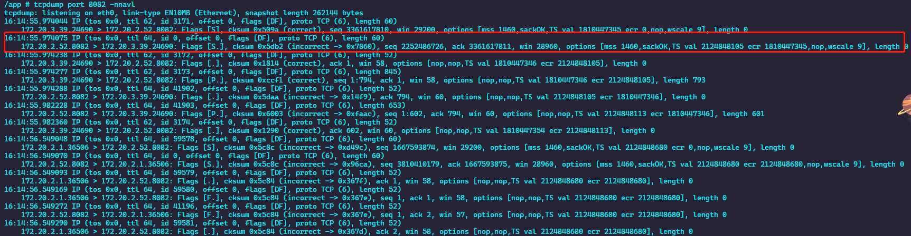

## `tcpdump` (tcpflow)

### 格式

```
    tcpdump [option] [proto] [direction] [type]
```
  
#### `option`

>可选参数

- 不解析选项
  - `-n`: 禁用 `ip` 解析为域名, 直接显示 ip
  - `-nn`: 禁用协议和端口转化为名字
  - `-N`: 不输出 `host` 域名部分
  
- 解析详细内容选项
  - `-v`: 输出详细的内容; 包含包的 TTL, id 标识, 数据长度以及 IP 的等选项
  - `-vv`: 产生比 `-v` 更详细的输出
  - `-vvv`: 产生比 `-vv` 更详细的输出

- 时间选项
  - `-t`: 每行输出不输出时间
  - `-tt`: 每行输出输出时间戳
  - `-ttt`: 输出每两行的时间间隔 (单位毫秒)
  - `-tttt`: 每行输出的时间戳之前添加日期的打印

- 网卡选项
  - `-i`: 指定要过滤的网卡

- 其他选项
  - `-A`: 以 `ASCII` 码方式输出数据包, 更直观
  - `-I`: 基于行的输出
  - `-q`: 简洁方式输出打印
  - `-c`: 捕获 `count` 个包就退出
  - `-s`: 默认截取前 `96` 字节的内容, 可以使用 `-s number` 指定截取长度
  - `-S`: 使用绝对序列号, 不用使用相对序列化
  - `-C`: 输出内容保存到文件
  - `-F`: 使用 `file` 文件作为过滤表达式

- 输出内容
  - `-D`: 显示所有可用网络接口的列表
  - `-e`: 每行的打印输出中将包括数据包的数据链路层头部信息
  - `-E`: 揭秘IPSEC数据
  - `-L`: 列出指定网络接口所支持的数据链路层的类型后退出
  - `-Z`: 后接用户名，在抓包时会受到权限的限制。如果以root用户启动tcpdump，tcpdump将会有超级用户权限。
  - `-d`: 打印出易读的包匹配码
  - `-dd`: 以C语言的形式打印出包匹配码.
  - `-ddd`: 以十进制数的形式打印出包匹配码

#### `proto`

>可选参数, 根据协议进行过滤, 可识别的关键字有: `upd`, `udp`, `icmp`, `ip`, `ip6`, `arp`, `rarp`, `ether`, `wlan`, `fddi`, `tr`, `decnet`

#### `direction`

>可选参数, 根据数据流向进行过滤, 可识别的关键字有: `src`, `dst`; 可以使用逻辑运算符进行组合使用

#### `type`

>可选参数, 可识别的关键字有: `host`, `net`, `port`, `portrange`; 后面接具体参数的值


### 内容



```
16:14:55.974238 IP (tos 0x0, ttl 62, id 3172, offset 0, flags [DF], proto TCP (6), length 52)
    172.20.3.39.24690 > 172.20.2.52.8082: Flags [.], cksum 0x1814 (correct), ack 1, win 58, options [nop,nop,TS val 1810447346 ecr 2124848105], length 0
```

- 第一列: 时分秒毫秒 16:14:55.974238
- 第二列: 网络协议 IP
- 第三列: 发送方的 ip + 端口号 172.20.3.39.24690
- 第四列: 箭头 表示数据流向 >
- 第五列: 接收方的 ip + 端口号 172.20.2.52.8082
- 第六列: 冒号
- 第七列: 数据包内容, 包括 Flags 标识符, seq 号, ack 号, win 窗口, 数据长度 length, 其中 [.] 为标志位

### Flags 标识符

>使用 tcpdump 抓包后，会遇到的 TCP 报文 Flags，有以下几种：

- [S] : SYN（开始连接）
- [P] : PSH（推送数据）
- [F] : FIN （结束连接）
- [R] : RST（重置连接）
- [.] : 没有 Flag （意思是除上面四种类型外的其他情况，有可能是 ACK 也有可能是 URG

### 规则组合

- `and`: 所有的条件都需要满足，也可以表示为 &&
- `or`: 只要有一个条件满足就可以，也可以表示为 ||
- `not`: 取反，也可以使用 !

### 常用规则

```shell
tcpdump host 192.168.0.1 # host 过滤
tcpdump -i eth2 src 192.168.10.100 # 根据源 ip 过滤
tcpdump net 192.168.10.0/24 # 根据网段过滤
tcpdump port 8082 # 根据端口过滤
tcpdump src port 8082 # 根据目标端口过滤
tcpdump port 8082 or port 80
tcpdump icmp # 根据协议过滤
```

## 参考

- [tcpdump](https://baijiahao.baidu.com/s?id=1671144485218215170&wfr=spider&for=pc)
