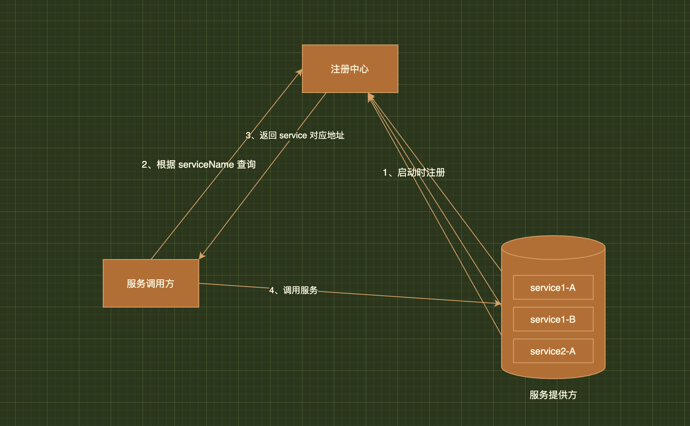

# 微服务注册中心

### 注册中心原理

> 注册中心主要涉及到三大角色
> 
> 1. 服务提供者
> 
> 2. 服务消费者
> 
> 3. 注册中心

它们之间的关系大致如下:

1. 各个微服务在启动时，将自己的网络地址等信息注册到注册中心，注册中心存储这些数据。

2. 服务消费者从注册中心查询服务提供者的地址，并通过该地址调用服务提供者的接口。

3. 各个微服务与注册中心使用一定机制（例如心跳）通信。如果注册中心与某微服务长时间无法通信，就会注销该实例。

4. 微服务网络地址发送变化（例如实例增加或IP变动等）时，会重新注册到注册中心。这样，服务消费者就无需人工修改提供者的网络地址了。

### 注册中心功能

注册中心应具备以下功能：

1. 服务注册表

> 服务注册表是注册中心的核心，它用来记录各个微服务的信息，例如微服务的名称、IP、端口等。服务注册表提供查询API和管理API，查询API用于查询可用的微服务实例，管理API用于服务的注册与注销。

2. 服务注册与发现

> 服务注册是指微服务在启动时，将自己的信息注册到注册中心的过程。服务发现是指查询可用的微服务列表及网络地址的机制。

3. 服务检查

> 注册中心使用一定的机制定时检测已注册的服务，如发现某实例长时间无法访问，就会从服务注册表移除该实例。

# [搬迁地址](https://www.cnblogs.com/haha12/p/11532910.html)
