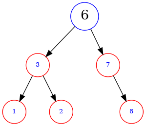
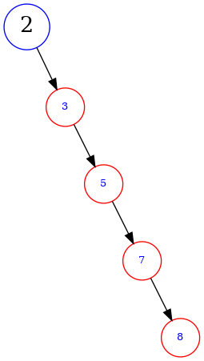
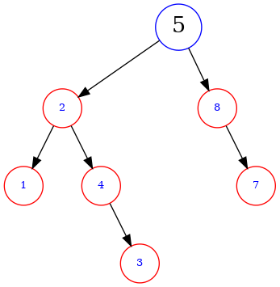

### `二叉树`

>左子树对键值小于根的键值, 右子树对键值大于根的键值

>tips: 但, 会这样 

### `平衡二叉树 (avl)`

>符合二叉树的定义之上, 且满足左子树和右子树的的绝对值之差不超过1

### `B 树 (B-树)`

>

### `B+树`

### 参考

- [如何画一棵漂亮的二叉树](https://zhuanlan.zhihu.com/p/62777936)
