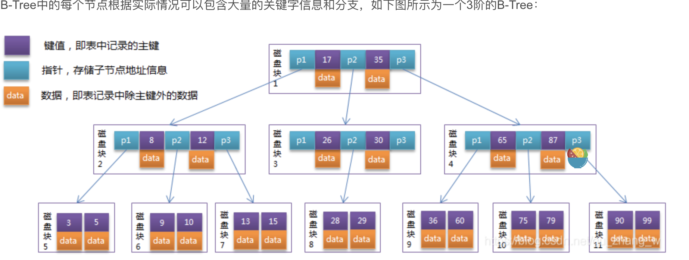
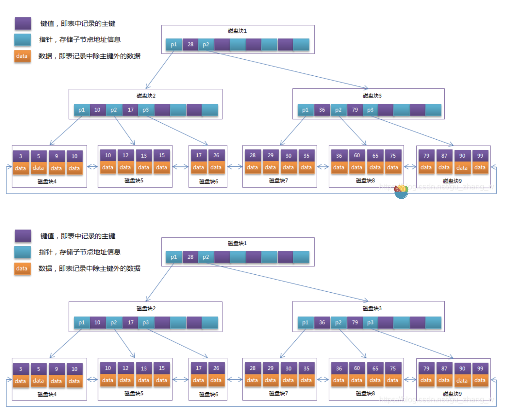

### `二叉树`

>左子树对键值小于根的键值, 右子树对键值大于根的键值

>tips: 但, 会这样 

### `平衡二叉树 (avl)`

>符合二叉树的定义之上, 且满足左子树和右子树的的绝对值之差不超过1

### `B 树 (B-树)`

> - 将一条记录定义为一个 `二元组 [key, data]`, `key` 为记录的键值，对应表中的主键值，`data` 为一行记录中除主键外的数据。对于不同的记录，`key` 值互不相同
> - 每个节点最多有 `m` 个孩子 (m 阶)
> - 除了根节点和叶子节点外，其它每个节点至少有 `Ceil(m/2)` 个孩子。
> - 若根节点不是叶子节点，则至少有2个孩子
> - 所有叶子节点都在同一层，且不包含其它关键字信息
> - 每个非终端节点包含n个关键字信息 `(P0,P1,…Pn, k1,…kn)`
> - 关键字的个数n满足：`ceil(m/2)-1 <= n <= m-1`
> - `ki(i=1,…n)` 为关键字，且关键字升序排序。
> - `Pi(i=1,…n)` 为指向子树根节点的指针。`P(i-1)` 指向的子树的所有节点关键字均小于 `ki`，但都大于 `k(i-1)`

### `B+树`

> - 每个节点的指针上限为2d而不是2d+1。

> - 内节点不存储data，只存储key；叶子节点不存储指针。

### 参考

- [如何画一棵漂亮的二叉树](https://zhuanlan.zhihu.com/p/62777936)
- [mysql 索引原理](https://blog.csdn.net/gu_zhang_w/article/details/107372917)
